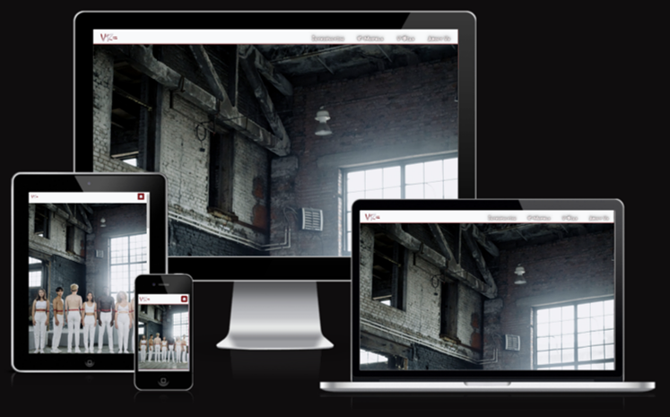

# Someone Like You

Someone Like You is an informational site designed for users to find out more about issues relating to gender equality in the workplace. Through educating users it also has the aim of helping them to better understand and take action relating to their own situation, whether that be as an employee or employer.

This project has been created as part of Code Institute's Hackathon Event September 2022, "Time To Close The Gender Gap".

You can visit the live website [here](#).

amiresponsive image here:

## Concept

Women are significantly underrepresented in the science, technology, engineering and maths (“STEM”) workforce. [According to Eurostat](https://www.weforum.org/agenda/2022/02/women-gender-technology-economy-representation-equality), women hold only 17% of major technology jobs, such as programming, systems analysis, or software development.

One reason for this is that visibility of women and minorities in STEM fields is often limited, "it's hard to be what you can't see".

Greater awareness of women and minorities in these areas can help to increase the ability of these groups to consider STEM fields as viable career options. Knowledge of female role models has also been demonstrated to reduce the implicit biases that are shown via studies to be present in both men and women.

Much more detail on this topic is available [in this report](https://www.aauw.org/app/uploads/2020/03/Solving-the-Equation-report-nsa.pdf) by the AAUW, a non-profit organisation in the USA that advances equity for women and girls through advocacy, education, and research.

Someone Like You therefore has a number of aims:

- Provide information about successful people from different backgrounds, so that users can see examples of people who they identify with who have been successful
- Educate users about some of the issues facing women in the workplace
- Inform users about the concept of unconscious bias, and enable them to test their own implicit associations

The site is designed to cater for a range of users, including male and female employers and (prospective) employees. More detail on this can be seen in the User Stories section below.

### User Stories

- As a female or minority employee or prospective employee, I would like to know more about other people with my background who have been successful in the field(s) I am working or interested in working in.
- As an employer, I would like to understand the issues facing my employees and how to address these issues in order to attract a wider range of talent.
- As a parent, I would like my children to grow up with knowledge of a range of positive female and male role models, but I am unsure whether I have this knowledge myself. I would like to find out about successful individuals who I may previously have been unaware of.
- As a female or minority employee or prospective employee, I would like to know more about the issues I face or may face in the workplace.
- As an employee or prospective employee who is not from a minority background, I would like to better understand the issues facing my peers.
- As a teacher, I would like to find content and information for my lessons, potentially enhance my knowledge, and help to provide my pupils with information about successful women and minorities, in particular to encourage girls who are uncertain about their own choices or abilities to believe that their preferred career is a viable choice for them.

### Owner Goals

- As the site owner, I want to fulfil the needs and wishes of these users.
- As the site owner, I want to provide clear, well-presented and accurate information.
- As the site owner, I want to provide an enjoyable experience for users.
- As the site owner, I want users to be able to access the site from any size of device.
- As the site owner, I want users to be inspired to learn more. As such, I want to provide some basic information, but also link out to external sources from which users can find out more.
- As the site owner, I want users to enjoy the site and find it interesting enough that they think it is worth sharing with others.

## Design

The project has been designed according to the five planes of content strategy. Further details are below:

### Plane 1: Strategy

The strategy of the website is largely defined by the user and owner goals listed above in the Concept section. The strategy is simply to provide solutions to the goals of the website's users and owners.

### Plane 2: Scope

Our team identified a number of possible features for the project. We focused on initially creating a minimum viable product ("MVP"), with other features to be added at a later date if time allowed:

- Information on a range of diverse people who have been successful at what they do
    - importance 5
    - viability 5
- Calendar featuring a different person for each day of the year
    - importance 2
    - viability 2
- Quiz on different people and what they have accomplished
    - importance 3
    - viability 3
- Information on a range of specific diversity-related issues
    - importance 5
    - viability 5
- Information on unconscious bias and links to external site(s) with more information
    - importance 5
    - viability 5
- Unconscious bias test
    - importance 4
    - viability 2

### Plane 3: Structure

### Plane 4: Skeleton

Wireframes for the project can be seen [here](#).

### Plane 5: Surface

#### Colour Scheme

#### Typography

#### Images

#### Presentation

## Features

### Current Features

#### Title

#### Section 1

#### Section 2

#### Section 3

### Potential Future Features

Implicit Association Test on this website itself rather than linking out to an external site

## Technologies Used

### Languages

- [HTML](https://en.wikipedia.org/wiki/HTML)
- [CSS](https://en.wikipedia.org/wiki/CSS)
- [JavaScript](https://en.wikipedia.org/wiki/JavaScript)

### Frameworks and Libraries

- [Balsamiq](https://balsamiq.com/)
- [GitHub](https://github.com/)
- [GitPod](https://gitpod.io/)
- [Chrome Dev Tools](https://developers.google.com/web/tools/chrome-devtools)
- [Google Fonts](https://fonts.google.com/)
- [Favicon](https://www.favicon.cc/)
- [Free Logo Design](https://www.freelogodesign.org/)
- [Amiresponsive](http://ami.responsivedesign.is/)
- [Bootstrap 5](https://getbootstrap.com/)

## Testing

### Manual Testing

### Device and Cross-Browser Testing

### Validator Testing

- [W3C HTML validator](https://validator.w3.org/)
- [Jigsaw CSS validator](https://jigsaw.w3.org/css-validator/)
- [JS Hint JavaScript validator](https://jshint.com/)

- The website was also tested for accessibility using Lighthouse in Dev Tools, with the following results:

### Bugs

The following bugs were found during build and have been resolved:

The following bugs are unresolved:

## Deployment

The project was deployed to GitHub Pages. The steps taken to deploy are:
- In the GitHub repository for the site, click on the ‘Settings’ tab along the top of the page.
- This brings up a General Settings page with a selection of menu items down the left-hand side.
- In this new menu, click on “Pages”.
- In the main body of the page, it is then possible to select a branch. Select the main branch. Click on “Save”.
- GitHub then provides a link to the published webpage, which can be clicked or copied and pasted like any other link.
- Further updates that are pushed to the branch will automatically appear in GitHub Pages.

### Forking a GitHub repository

It is possible to copy the repository in order to experiment with your own changes without affecting the original project. The steps to do this as as follows:
- Navigate to the GitHub website.
- Log in if necessary.
- Navigate to the repository that you want to fork.
- In the top right-hand corner of the page, click on "fork".
- You will be taken to a page to create your own fork. You can edit the project name and (optionally) add a description.
- Click on "create fork" to complete the process.

### Cloning a GitHub repository

It is also possible to copy the repository onto your own local machine. In practice, this might be done to make it easier to fix merge conflicts, add or remove files, and push larger commits. To do this, follow these steps:
- Navigate to the GitHub website.
- Log in if necessary.
- Navigate to the repository that you want to clone.
- Above the list of files, find the "Code" button and click on it:
 

- To clone the repository using HTTPS, under "Clone with HTTPS", click the clipboard icon. To clone the repository using an SSH key, including a certificate issued by your organization's SSH certificate authority, click Use SSH, then click the clipboard icon. To clone a repository using GitHub CLI, click Use GitHub CLI, then click the clipboard icon.
- Open your computer terminal.
- Change the current working directory to the location where you want the cloned directory.
- Type "git clone" and then paste the location that you have copied.
- Press "enter" and your local clone will be created.

## Credits

### Content and Media

### Code

### Other Credits
